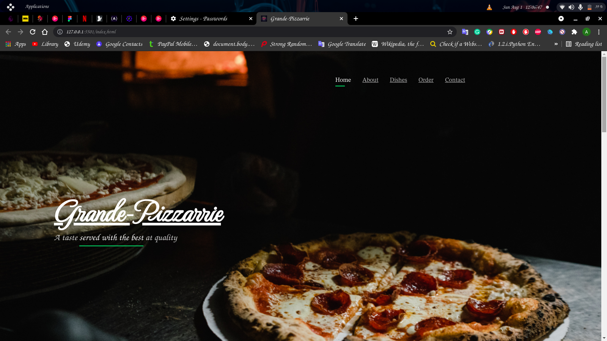
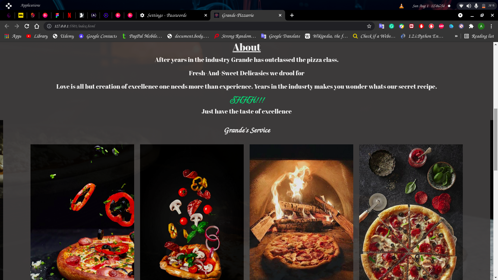
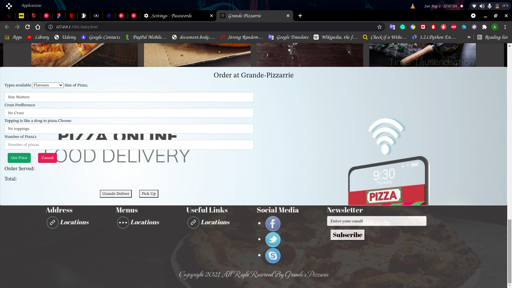

# Hello👋, I’m Anthony
---
***

## Author

*[Anthony Mutuku]*

# Grande Pizzarrie

##  Project Description
This is a web application for ordering Pizza

## Setup Instructions and Installation

- Clone the repository to a directory in you computer. Link to repo https://anthony64m.github.io/Grande-Pizarrie/
- Git init, git clone https://anthony64m.github.io/Grande-Pizarrie/
- Open terminal command line then navigate to the directory and open your using your favorite text editor.
- Open `index.html` on your Browser.
---
***

### Installation Medium
1. Steady Network.
2. Weblink
3. Github account.
---
***

## Technologies Used

* *[HTML5](https://github.com/topics/html5)*
* *[CSS](https://github.com/topics/css3)*
* *[Bootstrap](https://github.com/topics/bootstrap)*
* *[jQuery](https://github.com/topics/javascript)*
* *[javaScript](https://github.com/topics/javascript)*
---
***

# BDD
| Behaviour      | Input        | Output       |
| :------------- | :----------: | -----------: |
|  Select Pizza flavour |   select from options |   |
| select pizza size |select from options  |  |
|select crust | select from options |     |
| select toppings|  select from options   | :----------:|
| Checkout the order| :----------: | We have received your order and is being processed |
| Enter delivery details| Name, Phone number ,location  | -----------: |
---
***

## Known Bugs
* The total part ain't responding

## Contact Information 
[Email](anthony.mutuku@students.moringaschool.com)
#### [github](anthony64m.github.io)
---
***
#### Live Page 
https://anthony64m.github.io/Grande-Pizarrie/
---
***

### LICENSE
### copyright@2021©Anthony	
